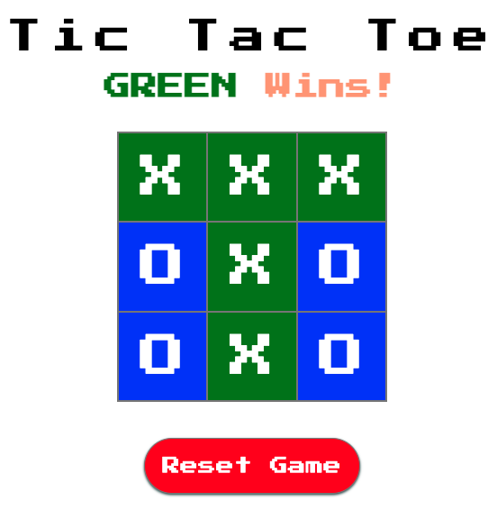

# Tic Tac Toe Game

This project is a simple implementation of the classic Tic Tac Toe game,
designed to demonstrate the use of client-side MVC (Model-View-Controller)
architectural patterns in web development. It allows two players to play the
game in a turn-based system, with a clean, retro-inspired interface.

## Features

- **Dynamic Game Status Updates:** The game header updates to show which
  player's turn it is or if the game has ended in a win or tie.
- **Color-Coded Players:** Each player's moves are color-coded for easy
  identification, with green representing player "X" and blue representing
  player "O".
- **Reset Functionality:** Allows players to start a new game at any time with
  a simple button click.
- **Responsive Design:** Utilizes a flexible grid layout that adjusts to the
  screen size, ensuring a consistent experience across devices.

## Implementation Details

### Technologies Used

- **HTML5:** Structures the game's layout and elements.
- **CSS3:** Styles the game including the grid, buttons, and dynamic coloring
  of player moves.
- **JavaScript:** Adds interactivity, including managing game state, player
  turns, and determining the game outcome.

### MVC Architecture

- **Model (Game Logic):** The core game logic, including tracking the state of
  the board, the current turn, and determining the winner.
- **View (Presentation):** HTML/CSS-based presentation of the game state,
  dynamically updated based on the model.
- **Controller (Interaction):** JavaScript-based listener and handler functions
  that manage user inputs (clicks) and update the model and view accordingly.

#### Key Components

- `index.html`: The game's HTML structure, including the board layout and
  reset button.
- `style.css`: Contains all the styles for the game, including the grid display
  and dynamic coloring.
- `script.js`: Implements the game's functionality, incorporating event
  listeners, state management, and rendering.

## How to Run

1. Clone the repository to your local machine.
2. Open `index.html` in your browser to start playing the game.
3. Click on any of the grid spaces to make your move.
4. Click the "Reset Game" button below the grid to start a new game at any point.

## License

This project is open source and available under the [MIT License](LICENSE.md).
